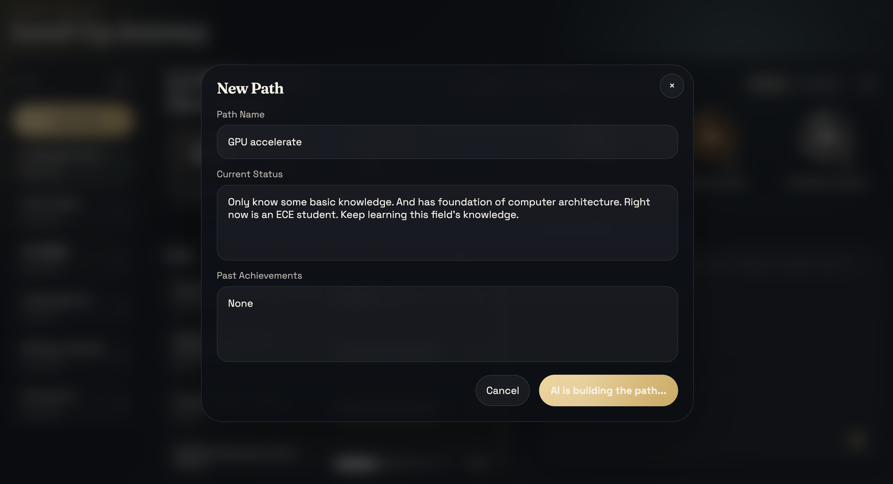
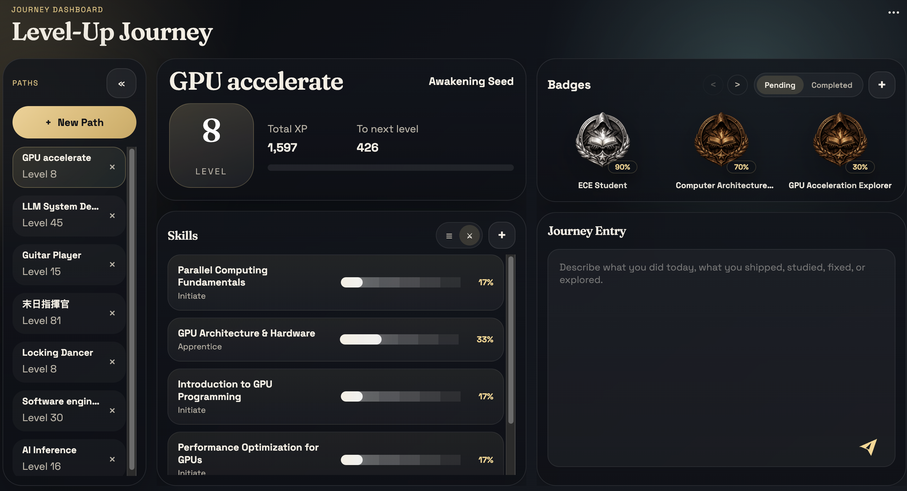
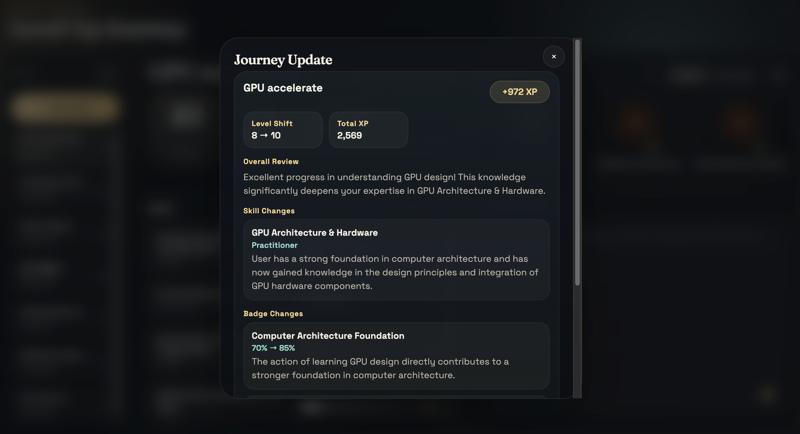
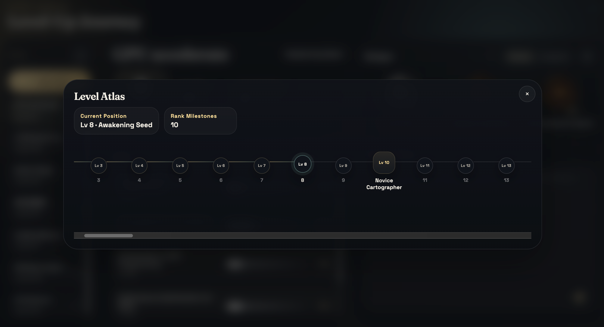
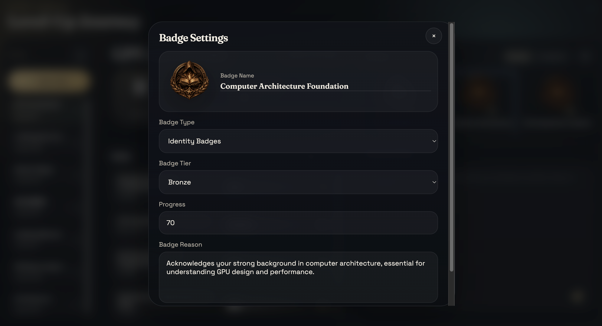
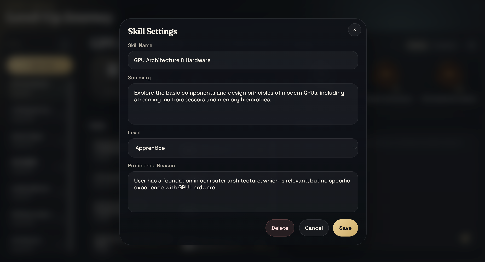

# Level-Up Journey

Level-Up Journey is a gamified growth tracker that turns daily effort into a visible upgrade system. Instead of trying to judge a person's absolute ability with rigid scoring, it focuses on making progress feel tangible: paths become classes, domains become skill trees, badges capture identity and achievements, and every meaningful action can move the journey forward.

It is designed for people who are already learning, building, shipping, researching, or improving every day, but want a cleaner and more motivating way to see that effort accumulate. With AI-assisted path initialization, action-log evaluation, level progression, editable skills, and badge-based feedback, the product turns abstract self-improvement into something you can actually watch evolve.

## Quickstart

1. Create your environment file from the example.

```bash
cp .env.example .env
```

2. Fill in the required variables.

```bash
GOOGLE_API_KEY=your_gemini_api_key
```

3. Start the stack.

```bash
docker-compose up --build -d
```

4. Open the app.

- Frontend: `http://localhost:5173`
- Swagger: `http://localhost:8000/docs`

## Demo

Level-Up Journey starts from a simple pain point: most learning and progress tracking tools either feel too manual, too dry, or too judgmental. This app is meant to feel more like opening a character sheet than filling out a productivity form. You define a growth direction, let AI shape the first version of your journey, then keep feeding it daily work so the system can reflect growth back to you in a visible, motivating way.

The first step is creating a new Path. A Path is your main progression route, similar to a class or role in a game. It can represent a concrete direction like GPU acceleration, AI inference, backend engineering, or anything else you want to grow into. You provide the path name, your current state, and past achievements, then let AI generate the initial structure.



From there, the system uses LLM-based analysis to initialize the route: it estimates a starting level, proposes initial skill domains, and generates identity and achievement badges that match your background. Instead of starting from a blank page, the player begins with a meaningful scaffold that can still be edited later.



The dashboard is the core play space:

- Left sidebar: all Paths, sorted by your most recently opened route.
- Top-left main panel: overall level, total XP, next-level progress, and current title.
- Skill panel: editable domain-based skill progression for the selected Path.
- Badge panel: achievement and identity badges, including progress and completion state.
- Journey Entry: where the player submits daily learning, work, research, fixes, or progress updates.

The main gameplay loop happens through Journey Entry. The player writes what they worked on today, what they learned, built, shipped, debugged, or explored. The backend sends that to AI, which matches the entry to the most relevant Path and Domains, evaluates the contribution, assigns XP, and updates the growth state accordingly.



Once submitted, the journey updates immediately. The system can increase XP, trigger a level-up, refine skill proficiency, and push badge progress forward when there is enough evidence. It also returns a structured feedback summary so the player can see what changed and why it mattered.

You can also open the level view to inspect the broader progression track. This shows how the current level sits inside the full journey and how the title system evolves across milestones. Levels are not just numbers here; they are part of a narrative progression layer tied to the player's route.



Badges are split into two categories: identity badges and achievement badges. Identity badges reflect who the player is becoming in that route, while achievement badges reflect concrete progress. Both can be edited, and badge tier can be manually adjusted across bronze, silver, and gold when needed.



Skills represent the core domains inside a Path. Each skill carries a proficiency rating and an AI-written reason explaining why the current rating makes sense. The dashboard supports multiple skill views, and each domain can be edited directly so the player keeps control over how the skill panel evolves.



Level-Up Journey is ultimately about turning vague effort into visible momentum. It gives structure without removing flexibility, and feedback without making progress feel clinical. The result is a system that feels closer to leveling up a character than maintaining a checklist.
